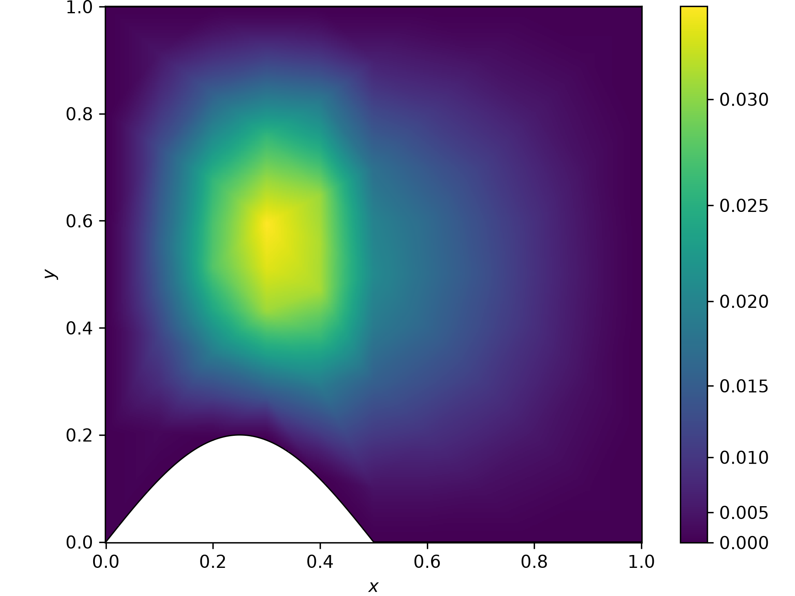

# menedpy

**menedpy** is a Python library to compute the numerical solution of partial differential equations (PDEs) using the finite element method (FEM).

The library is designed to solve PDEs with the following structure:

$$\partial_t u(x,y,t) - \nabla \cdot \left(\alpha(x,y)\nabla u(x,y,t)\right) + u(x,y,t)^2 = f(x,y,t),$$

where:

* $\alpha(x,y)$ is the diffusion coefficient.
* $f(x,y,t)$ is the source term.
* $u(x,y,t)$ is the unknown solution.

The name **menedpy** comes from **MÉ**todos **N**uméricos para **EDP** (Numerical Methods for PDEs) and **PY**, referring to the Python programming language.

## Installation

### Requirements

* Python 3.x
* Git

### From source

1. Clone the repository and enter the project directory:

    ```bash
    git clone https://github.com/pedropasa03/menedpy
    cd menedpy
    ```

 2. Create a virtual environment and activate it:
    
    ```bash
    python -m venv .venv
    .\.venv\Scripts\activate
    ```

5. Install the required build tools and build the package:

    ```bash
    python -m pip install --upgrade pip setuptools build
    python -m build
    ```

    This will generate the distribution files inside the `dist/` directory.

6. To install the generated package into the virtual environment:

    ```bash
    python -m pip install dist/*.whl
    ```

## Usage

An example of the library in use can be found in [`examples/main.py`](examples/main.py).

On Windows, you can run the example with:

```bash
.\.venv\Scripts\python .\examples\main.py
```

You should see the computed results displayed on the screen, together with the following image:



The example can be modified to experiment with different domains, parameters, and problem settings.

## Documentation

Documentation and detailed descriptions of the available classes, functions, and numerical methods are currently provided through the source code and examples.

## Contributing

Contributions, bug reports, and suggestions are welcome.

## License

This project is licensed under the MIT License. See the [LICENSE](LICENSE) file for more details.
